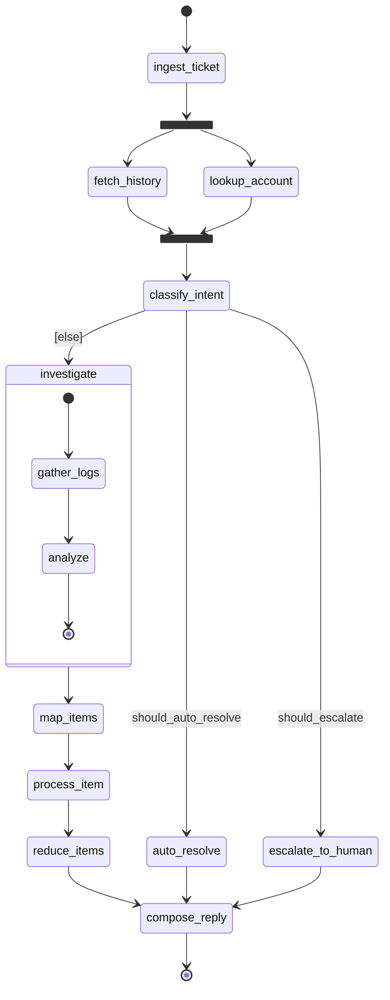

<div align="center">

# langgraph to-from mermaid (lg2m)

**Keep your LangGraph or LangChain graph and its Mermaid diagram in sync, both ways, and fail the build when they drift.**


[Installation](#installation) • [How it works](#how-it-works) • [The CLI](#the-cli) • [Scope](#langgraph-and-langchain-scope) • [Run an example](#try-the-runnable-example) • [Roadmap](#status-and-roadmap)

</div>

---

> [!NOTE]
> **v0.1.0.** The package is built and green end-to-end: the intermediate
> representation, the config loader, the Markdown / Mermaid parsers, the annotation
> decorators and `router`, the diff and report engine, the real LangGraph introspector,
> the Typer CLI, code/contract generation (`scaffold/` + `gen`), and prose sync
> (`sync` verb with `.lg2m.lock` baseline). The CLI ships `check`, `validate`,
> `list`, `init`, `gen`, and `sync`. Install from PyPI or a GitHub tag — see
> [Installation](#installation). The annotated example checks clean under `lg2m check`;
> the plain native example ([below](#try-the-runnable-example)) runs today. The design
> lives in [`docs/design.md`](docs/design.md) and the competitive landscape in
> [`PRIOR-ART.md`](PRIOR-ART.md).

`lg2m` (`langgraph_to_from_mermaid`) is a Python package and CLI that
treats a Mermaid `stateDiagram-v2`, written in Markdown, as a checkable contract
for a LangGraph or LangChain graph. This high fidelity app reads the real compiled 
graph for topology truth, reads code annotations that link each symbol to the 
diagram, and reports drift in either direction with file and line locations, or 
scaffolds one side from the other.

A diagram drifts from the code the moment either changes. Tools that draw a graph
from code are one-way; builders that generate code from a diagram throw the
diagram away afterward. `lg2m` keeps the two honest over time and makes
disagreement a build failure. See [`PRIOR-ART.md`](PRIOR-ART.md) for where it sits
among existing tools.

## Installation

**From PyPI:**

```bash
pip install langgraph-to-from-mermaid
```

Add the `[langgraph]` extra to enable `lg2m check` and the real introspector:

```bash
pip install "langgraph-to-from-mermaid[langgraph]"
```

**From a GitHub release tag** (no PyPI needed):

```bash
pip install "git+https://github.com/psenger/langgraph_to_from_mermaid.git@vX.Y.Z"
# with the langgraph extra:
pip install "langgraph-to-from-mermaid[langgraph] @ git+https://github.com/psenger/langgraph_to_from_mermaid.git@vX.Y.Z"
```

Replace `vX.Y.Z` with the tag you want (e.g. `v0.1.0`). Tags are listed on the
[GitHub Releases page](https://github.com/psenger/langgraph_to_from_mermaid/releases).

**From a clone** (for development or to track `main`):

```bash
git clone https://github.com/psenger/langgraph_to_from_mermaid.git
cd langgraph_to_from_mermaid
python3 -m venv .venv && source .venv/bin/activate
pip install -e ".[dev]"            # foundation layer only
# pip install -e ".[langgraph,dev]" # add the introspector
```

Once installed, the `lg2m` command is on your `PATH`.

## How it works

`lg2m check` reconciles three sources and exits non-zero when they disagree:

1. **Topology (introspection).** The real nodes, edges, conditional flags,
   `path_map` targets, and the state schema with its reducers, read from
   `compiled.get_graph(xray=True)`. This is the source of truth for graph shape.
2. **Annotations.** `@node`, `@predicate`, `lg2m.router`, `@state_model`, and
   `@data_model` link each symbol to the diagram and the Markdown. They record
   metadata and return their target unchanged, so they do not alter runtime
   behavior.
3. **The Markdown contract.** A purely topological Mermaid `stateDiagram-v2`, plus
   tables, hidden fences, and notes for the facts a diagram cannot draw (reducers,
   `Command` destinations, `Send` width).

### Routing cannot drift

Conditional routing is the part most likely to rot, so `lg2m` owns it. You declare
a fan-out as an ordered mapping of named predicates ending in a required `[else]`
default; `lg2m` generates the router and the `path_map` from that one mapping.

```python
from lg2m import predicate, router, ELSE

@predicate("should_escalate")
def should_escalate(state) -> bool:          # a whole leaf condition; you write this
    f = state["flags"]
    return (f.get("urgent") or f.get("vip")) and not f.get("resolved")

# the fan-out as an ordered mapping; lg2m builds the selector and owns the path_map
route_after_classify = router("classify_intent", [
    ("should_escalate",     "escalate_to_human"),
    ("should_auto_resolve", "auto_resolve"),
    (ELSE,                  "investigate"),   # required default
])
```

Because the diagram labels, the runtime selector, and the `path_map` all come from
the same mapping, they cannot disagree. The only independently authored surface
left is the Markdown, which is exactly what `check` reconciles.

### What the contract looks like

The diagram is plain Mermaid that renders on GitHub. The conditional edges are
labelled with the predicate names, and the default branch is labelled `[else]`:



A clean run reports each source as in agreement (illustrative output; run
`lg2m check` for the real report):

```text
lg2m check
graph: support_pipeline  (support_pipeline.graph:build_graph -> CompiledStateGraph)
  introspected: 11 nodes, 15 edges (5 conditional), state PipelineState (8 fields)

  nodes .......... 11/11  OK   (@node ids == graph nodes == diagram states)
  routing ........ OK         (router mapping == path_map == get_graph labels == diagram)
  reducers ....... 4/4    OK   (add_messages, operator.add x2, extend_unique)
  diagram ........ OK
  diagnostics .... none

0 drift items. exit 0
```

The full annotated source and contract are in
[`examples/support_pipeline/`](examples/support_pipeline/).

## The CLI

The CLI ships today (see [`docs/design.md`](docs/design.md) Section 11). Configuration lives in an
`lg2m.toml` that maps a graph id to its entry point and Markdown contract.

| command | what it does |
| --- | --- |
| `init` | scaffold a starting `lg2m.toml` |
| `list` | list the configured graphs |
| `validate` | each side parses, the entry point imports, every fan-out has an `[else]` |
| `check` | reconcile topology, annotations, and the diagram; non-zero on drift |
| `gen --from-doc` | scaffold annotated code from the Markdown contract |
| `gen --from-code` | scaffold the Markdown contract from code plus annotations |
| `sync` | write prose back across the code/doc boundary using a `.lg2m.lock` baseline |

Exit codes: `0` clean, `1` drift or structural error, `2` usage or config error.
`gen` emits LangGraph today; LangChain emission is on the roadmap (the routing model
compiles to both). `gen` writes only where asked: `--out` writes files and refuses to
overwrite, and without it the output is a stdout dry-run. `sync` supports `--prefer
code|doc` conflict resolution and `--dry-run`.

## LangGraph and LangChain scope

Full bidirectional fidelity is for **LangGraph**. For **LangChain**, `lg2m` covers
the LCEL-expressible slice (linear chains plus `RunnableBranch`). The routing model
is portable to both frameworks; the wider graph (parallel fan-out with reducers,
`Send` map-reduce, `Command(goto)`, subgraphs) has no LCEL equivalent and is
LangGraph-only. The [examples](examples/) include a per-construct breakdown of
what LangChain can and cannot express.

## Try the runnable example

The plain native example runs today. It is the same graph in both frameworks, with
deterministic node bodies (no LLM calls, no API keys), so runs are reproducible.

```bash
cd examples/support_pipeline_native
python3 -m venv .venv
source .venv/bin/activate
python -m pip install -r requirements.txt
python langgraph_app.py     # the full graph
python langchain_app.py     # the slice LCEL can express
python introspect.py        # the topology lg2m would read via get_graph(xray=True)
```

[`examples/support_pipeline/`](examples/support_pipeline/) is the same graph with
`lg2m` applied (annotations plus the Mermaid and Markdown contract); run `lg2m check`
against it for a clean reconcile.

## Status and roadmap

v0.1.0 — all layers shipped and green. The build order from [`docs/design.md`](docs/design.md)
Section 13 is complete:

1. **Done.** IR, config loader, and the Markdown / Mermaid parsers (no framework import).
2. **Done.** Annotations and the `router`, the diff engine, and the reports; reconciliation
   runs against a fake introspector and fixtures.
3. **Done.** The LangGraph introspector behind the `[langgraph]` extra, and a runnable `check`.
4. **Done.** The Typer CLI (`check`, `validate`, `list`, `init`, `gen`).
5. **Done.** `gen --from-doc` / `--from-code` with round-trip golden tests (LangGraph emission).
6. **Done.** `sync` verb: prose write-back with a `.lg2m.lock` baseline-hash store, 3-way
   merge, conflict detection, `--prefer code|doc` resolution, and `--dry-run`.

Next: LangChain code emission, full subgraph / `Send` / `Command` round-trip fidelity, and a
version-matrix CI across LangGraph / langchain-core releases.

## Repository layout

```
.
  docs/design.md               the design
  PRIOR-ART.md                 competitive landscape and the novelty claim
  src/lg2m/                    the package: IR, parsers, annotations, router, introspector,
                               diff, report, CLI, and scaffold/ (gen)
  tests/                       the pytest suite (framework-free, plus @langgraph-gated)
  docs/prose-sync.md           design notes that preceded the sync/ implementation
  examples/
    support_pipeline_native/   runnable: the graph in LangGraph + LangChain, before lg2m
    support_pipeline/          the same graph annotated, with its Mermaid/Markdown contract (checks clean)
```

## Prior art

`lg2m`'s novelty is the combination of bidirectional topology sync,
drift-as-a-build-contract, and LangGraph awareness. Every individual capability
exists in isolation elsewhere; the full landscape and what would falsify the claim
are in [`PRIOR-ART.md`](PRIOR-ART.md).

## Contributing

The design is settled in [`docs/design.md`](docs/design.md), and the "Next" items above are the natural
first-issues list. Start by opening a bug or feature issue, then cut a branch from `main`
and open a pull request back to `main`. The framework-free pieces (LangChain emission in
`scaffold/`, the prose `sync` verb) are a good place to start. See
[`CONTRIBUTING.md`](CONTRIBUTING.md) for the full workflow, local setup, and the release process.

## License

MIT. See [`LICENSE`](LICENSE).

---

<div align="center">

**lg2m: one graph, one diagram, no drift.**

[Design](docs/design.md) • [Prior art](PRIOR-ART.md) • [Examples](examples/)

</div>
