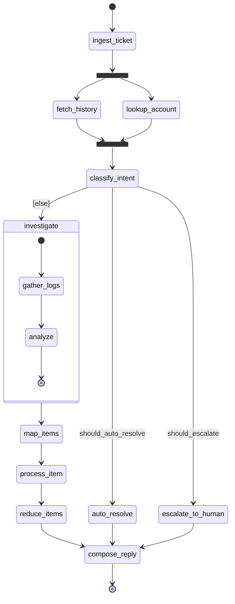

# support_pipeline

The contract for the `support_pipeline` graph: a topological Mermaid
`stateDiagram-v2` plus the structured metadata, tables, and prose the diagram
cannot carry. `lg2m check` reconciles three sources against each other: the real
topology from `compiled.get_graph(xray=True)`, the lg2m annotations in `src/`
(`@node` / `@predicate` / `lg2m.router` / `@state_model` / `@data_model`), and
this file.

The diagram is **purely topological**. Each conditional branch is labelled with
the name of the `@predicate` that selects it, and the required default branch is
labelled `[else]`. Because lg2m generates the runtime router *and* its `path_map`
from the same ordered mapping in `routing.py`, the labels here, the compiled
graph's conditional-edge labels (`get_graph()`), and the router cannot drift; the
only independently authored surface is this Markdown. Anything the diagram cannot
draw (a reducer-governed parallel merge, a `Command(goto)` destination, a `Send`
worker and its runtime width) lives below as metadata, in the three forms the
plan defines: a visible key/value table, a hidden machine fence, and a free-text
`> Note:`.

## Index

| id | type |
| --- | --- |
| `ingest_ticket` | node |
| `fetch_history` | node |
| `lookup_account` | node |
| `classify_intent` | node |
| `auto_resolve` | node |
| `escalate_to_human` | node |
| `investigate` | node |
| `gather_logs` | node |
| `analyze` | node |
| `map_items` | node |
| `process_item` | node |
| `reduce_items` | node |
| `compose_reply` | node |
| `should_escalate` | predicate |
| `should_auto_resolve` | predicate |

## Graph

## Data Models

### `PipelineState`

The graph state (`@state_model`). lg2m confirms it matches the introspected
`builder.state_schema`; types and reducers are read from the real `Annotated[...]`
schema, not from this table.

| attribute | type | reducer | description |
| --- | --- | --- | --- |
| `ticket` | `Ticket` | - | the incoming support ticket |
| `messages` | `list` | `add_messages` | running transcript across nodes |
| `attempts` | `int` | `operator.add` | count of processing attempts |
| `enrichment` | `list` | `operator.add` | parallel merge of `fetch_history` + `lookup_account` |
| `flags` | `dict` | - | routing flags set by `classify_intent` |
| `items` | `list` | - | work items derived in `ingest_ticket` |
| `item_results` | `list` | `extend_unique` | `Send`-worker results, deduped on merge |
| `resolution` | `str` | - | final resolution text |

### `Ticket`

A payload model (`@data_model`, a pydantic `BaseModel`); not the graph state.

| attribute | type | reducer | description |
| --- | --- | --- | --- |
| `subject` | `str` | - | ticket subject line |
| `body` | `str` | - | ticket body |
| `priority` | `str` | - | `'low'` \| `'normal'` \| `'high'` |
| `customer_tier` | `str` | - | `'free'` \| `'pro'` \| `'enterprise'` |

## Predicates

### `should_escalate`

Selects the escalation branch when the ticket is urgent or from a VIP and is not
already resolved. The `and` / `or` / `not` lives in the function body; lg2m never
reads it.

### `should_auto_resolve`

Selects the canned-answer branch when the ticket is already resolved and has no
attachment to review.

## Nodes

### `ingest_ticket`

Entry node. Normalizes the `Ticket`, derives the work `items` the investigate path
maps over, and seeds `messages` / `attempts`. Fans out to the parallel enrichment
branches.

| meta | value |
| --- | --- |
| fan-out | parallel |
| targets | `fetch_history`, `lookup_account` |

### `fetch_history`

Parallel branch A. Writes the shared `enrichment` channel (prior-ticket history).

### `lookup_account`

Parallel branch B. Writes the shared `enrichment` channel (account tier). Runs
concurrently with `fetch_history`.

### `classify_intent`

Fan-in of the parallel enrichment and the conditional source. Computes the routing
`flags`; the generated router branches on `should_escalate` / `should_auto_resolve`
with `[else]` -> `investigate`.

<!-- lg2m: channel=enrichment; reducer=operator.add; merges=fetch_history,lookup_account -->

### `auto_resolve`

The `should_auto_resolve` branch: applies a known answer for an already-resolved
ticket, then converges on `compose_reply`.

### `escalate_to_human`

The `should_escalate` branch. A `Command` node: it routes from inside its body
with `Command(goto="compose_reply")`. The goto is invisible to `get_graph()`
unless declared, so `graph.py` declares `destinations=("compose_reply",)`; the
destination is restated here because the diagram cannot draw a goto.

<!-- lg2m: command_goto=compose_reply -->

### `investigate`

The `[else]` default branch. A subgraph (`gather_logs` -> `analyze`); under
`xray=True` lg2m sees its nodes flattened as `investigate:gather_logs` /
`investigate:analyze` and reconciles them against the composite state above.

### `gather_logs`

`investigate` subgraph node. Appears as `investigate:gather_logs` under xray.

### `analyze`

`investigate` subgraph node. Appears as `investigate:analyze` under xray.

### `map_items`

Prepares the dynamic fan-out: one `process_item` worker is dispatched per element
of `items` via `Send`. The diagram shows one representative worker.

<!-- lg2m: send_worker=process_item; width=dynamic -->

> Note: the number of `process_item` workers is a runtime value (one per item
> returned by `ingest_ticket`), so the diagram shows a single representative
> worker rather than a static count.

### `process_item`

One `Send` worker per item. Writes `item_results`, merged across the concurrent
workers by the custom `extend_unique` reducer.

### `reduce_items`

Join after the dynamic `Send` fan-out completes; summarizes `item_results` into
the `resolution`.

<!-- lg2m: channel=item_results; reducer=extend_unique; merges=process_item (Send) -->

### `compose_reply`

Terminal node. Assembles the customer reply from `resolution` and appends the
assistant message. Reached from `auto_resolve` (edge), `escalate_to_human`
(`Command` goto), and `reduce_items` (edge).

## Edges

| from | to | label | kind | notes |
| --- | --- | --- | --- | --- |
| `[*]` | `ingest_ticket` | | start | |
| `ingest_ticket` | `fork_enrich` | | fork | parallel fan-out |
| `fork_enrich` | `fetch_history` | | parallel | |
| `fork_enrich` | `lookup_account` | | parallel | |
| `fetch_history` | `join_enrich` | | join | |
| `lookup_account` | `join_enrich` | | join | |
| `join_enrich` | `classify_intent` | | unconditional | enrichment merged here (`operator.add`) |
| `classify_intent` | `escalate_to_human` | `should_escalate` | conditional | |
| `classify_intent` | `auto_resolve` | `should_auto_resolve` | conditional | |
| `classify_intent` | `investigate` | `[else]` | conditional | required default |
| `investigate` | `map_items` | | unconditional | |
| `map_items` | `process_item` | | send | dynamic fan-out; `get_graph` marks it conditional |
| `process_item` | `reduce_items` | | unconditional | |
| `reduce_items` | `compose_reply` | | unconditional | |
| `auto_resolve` | `compose_reply` | | unconditional | |
| `escalate_to_human` | `compose_reply` | | command | via `Command(goto)`, declared by `destinations=` |
| `compose_reply` | `[*]` | | end | |
