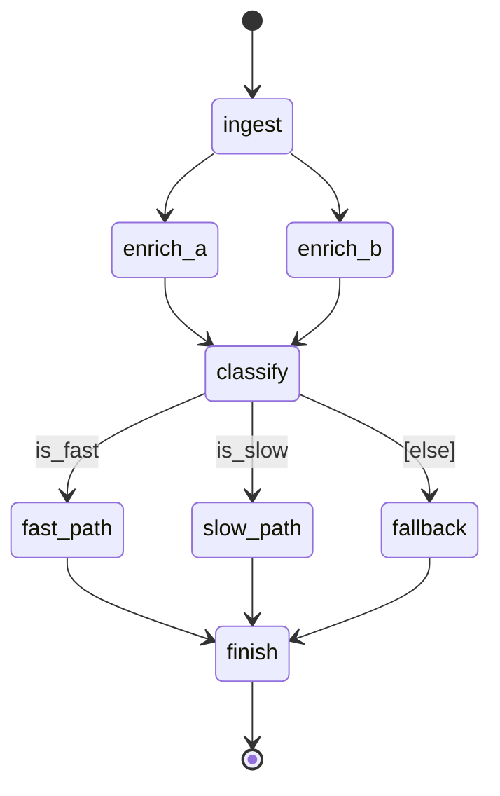

# mini_pipeline

A minimal lg2m contract used by the scaffold/gen golden round-trips. It exercises the
topological core that `gen` regenerates faithfully: a start edge, a parallel enrichment
fan-out and fan-in, one conditional fan-out with the required `[else]`, a convergence, and an
end edge, plus a `@state_model` with reducers and a `@data_model`. It deliberately has **no**
subgraph, `Send`, or `Command`, so it round-trips structurally through canonical mermaid and
generated LangGraph code.

## Index

| id | type |
| --- | --- |
| `ingest` | node |
| `enrich_a` | node |
| `enrich_b` | node |
| `classify` | node |
| `fast_path` | node |
| `slow_path` | node |
| `fallback` | node |
| `finish` | node |
| `is_fast` | predicate |
| `is_slow` | predicate |

## Graph

## Data Models

### `MiniState`

The graph state (`@state_model`).

| attribute | type | reducer | description |
| --- | --- | --- | --- |
| `messages` | `list` | `add_messages` | running transcript |
| `attempts` | `int` | `operator.add` | processing attempts |
| `enrichment` | `list` | `operator.add` | parallel merge of `enrich_a` + `enrich_b` |
| `flags` | `dict` | - | routing flags set by `classify` |
| `result` | `str` | - | final result text |

### `Payload`

A payload model (`@data_model`).

| attribute | type | reducer | description |
| --- | --- | --- | --- |
| `subject` | `str` | - | subject line |
| `body` | `str` | - | body text |

## Predicates

### `is_fast`

Selects the fast branch.

### `is_slow`

Selects the slow branch.

## Nodes

### `ingest`

Entry node; fans out to the parallel enrichment branches.

### `enrich_a`

Parallel branch A. Writes the shared `enrichment` channel.

### `enrich_b`

Parallel branch B. Writes the shared `enrichment` channel.

### `classify`

Fan-in of the parallel enrichment and the conditional source.

### `fast_path`

The `is_fast` branch.

### `slow_path`

The `is_slow` branch.

### `fallback`

The `[else]` default branch.

### `finish`

Terminal node.

## Edges

| from | to | label | kind | notes |
| --- | --- | --- | --- | --- |
| `[*]` | `ingest` | | start | |
| `ingest` | `enrich_a` | | parallel | |
| `ingest` | `enrich_b` | | parallel | |
| `enrich_a` | `classify` | | parallel | |
| `enrich_b` | `classify` | | parallel | |
| `classify` | `fast_path` | `is_fast` | conditional | |
| `classify` | `slow_path` | `is_slow` | conditional | |
| `classify` | `fallback` | `[else]` | conditional | required default |
| `fast_path` | `finish` | | unconditional | |
| `slow_path` | `finish` | | unconditional | |
| `fallback` | `finish` | | unconditional | |
| `finish` | `[*]` | | end | |
